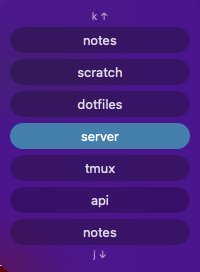

# tmux-switcher

**Switch between tmux sessions without losing your place.** tmux-switcher is a
small macOS heads-up display that shows — right where you're already looking —
which session your next-session / previous-session keys will jump to.

<p align="center">
  
</p>

## Why

If you keep one tmux session per project or task, jumping between them is
constant — and normally, to see what's there or land on the right one, you stop
and open tmux's session list (`prefix` + `s`), read it, pick, and return. That's
a context switch every single time, and it pulls your eyes and attention off
the work.

tmux-switcher removes that step. Hold the modifier and the sessions appear as a
compact stack over your terminal, current one highlighted, with the next and
previous sessions right above and below — so a `next`/`previous` tap is a glance
and a keypress, never a menu. You keep your hands on the keys and your attention
on the code. Over a day of hopping between workstreams, skipping the
open-the-menu-read-it-choose loop each time adds up.

It's a **read-only** visualizer: it shows you where your keys lead and never
drives tmux itself. The only tmux command it ever runs is `list-sessions`.

## How it looks and feels

Bound to the "Meh" layer (Ctrl+Alt+Shift, no Cmd) with `Meh+j` / `Meh+k` for
next / previous session, the loop is: hold **Meh**, tap `j`/`k` to preview the
session you'd land on, release to dismiss. The HUD tracks each switch instantly.

It runs as an `LSUIElement` background app — no Dock icon, no menu bar item, no
app-switcher entry — so it stays out of your way until you hold the modifier.

It is unsandboxed by necessity: it needs the Accessibility API to observe the
modifier key state and to know which window is focused, and it needs to spawn
`tmux` as a subprocess. App Sandbox would block both, so there is no
entitlements file and no sandbox keys in `Resources/Info.plist`. See
[What it does and doesn't touch](#what-it-does-and-doesnt-touch) for exactly
what that permission is used for.

## What it does and doesn't touch

tmux-switcher is unsandboxed and requests Accessibility, so it's fair to ask
exactly what it does with that. Everything below is verifiable in the source —
the relevant files are small and linked.

**Accessibility is used for two narrow, read-only things:**

- Reading the **title of the focused window** to know which session you're on
  (paired with the `set-titles` config below).
- Detecting when the **Meh modifier is held**, to know when to show the HUD.
  It watches modifier-flag *state* only
  ([`ModifierWatcher.swift`](Sources/TmuxSwitcher/ModifierWatcher.swift)) via
  `NSEvent.addGlobalMonitorForEvents(matching: .flagsChanged)` — it does **not**
  install a keyboard event tap, log keystrokes, capture typed text, read other
  applications' contents, or record the screen. It deliberately avoids the
  separate "Input Monitoring" permission for exactly this reason.

**It runs exactly one external command**
([`TmuxClient.swift`](Sources/TmuxSwitcherCore/TmuxClient.swift)):
`tmux list-sessions -F "#{session_name}"`, with fixed arguments and no shell.
It never switches, creates, renames, or kills sessions, and never writes to
your tmux config.

**It makes no network connections.** There is no HTTP, no telemetry, no
analytics — the app contains no networking code at all. Its only IPC is a
**local `AF_UNIX` socket** at `~/.config/tmux-switcher/notify.sock`
([`NotifyServer.swift`](Sources/TmuxSwitcher/NotifyServer.swift)), which an
optional local tmux hook can poke to nudge the session-list cache. Nothing
leaves the machine.

**The only files it touches** are under `~/.config/tmux-switcher/`: it reads
`config.json` if present and creates that directory and the local socket. It
writes nothing elsewhere.

It's open source and MIT-licensed, so every claim here can be checked directly. For a fuller audit — verification commands, supply-chain notes, and signing details — see [SECURITY.md](SECURITY.md).

## What this expects from your setup

tmux-switcher is a **visualizer, not a switcher**. It assumes you already have
session switching bound to a key chord, and it draws a picture of where those
bindings lead. It will never create, change, or invoke a binding for you — the
only tmux command it ever runs is `list-sessions`.

Two pieces of tmux configuration are load-bearing.

### 1. The window title must be the session name

```tmux
set -g set-titles on
set -g set-titles-string "#S"
```

This is how the app knows which session you are on: it reads the focused
Ghostty window's title through the Accessibility API rather than asking tmux.
It is also what makes the HUD track your switches instantly — macOS posts a
title-change notification the moment the title changes, so the display updates
from an authoritative push instead of polling or guessing.

**Without this the HUD simply never appears.** The title won't match any
session name, and the app deliberately shows nothing rather than displaying a
list it can't anchor to your current position.

### 2. Session switching bound to `switch-client -n` / `-p`

The bindings this was built around:

```tmux
bind -n C-M-S-j switch-client -n   # next session
bind -n C-M-S-k switch-client -p   # previous session
```

Any keys work so long as they sit on the Meh layer (Ctrl+Alt+Shift, no Cmd) and
drive `switch-client -n`/`-p`. The app watches for the Meh modifier itself; the
`j`/`k` keys are entirely tmux's business.

The order the HUD lists sessions in is not a guess — it is the same order tmux
cycles them. In tmux 3.6, `switch-client -n/-p` and `list-sessions` both go
through `sort_get_sessions()`, and with no `-O` flag that leaves the list in
`RB_FOREACH` order, which is `strcmp` by session name. So the app consumes
`list-sessions` output positionally and never re-sorts it.

> ⚠️ Adding `-O` or `-r` to your `switch-client` bindings changes that cycle
> order and the HUD will quietly disagree with where the keys actually take you.

### What it does not do

It only visualizes **session** switching. Window and pane navigation (`Meh+h`
/`Meh+l`, pane selection, resizing) are untouched — the HUD has no opinion about
them and won't appear for them.

## Install

```sh
brew install jekuari/tap/tmux-switcher
```

or

```sh
curl -fsSL https://raw.githubusercontent.com/jekuari/tmux-switcher/main/install.sh | bash
```

`TMUX_SWITCHER_VERSION=v0.2.0` pins a version;
`TMUX_SWITCHER_INSTALL_DIR=~/Applications` installs just for you instead of
every user of the Mac (see below).

After installing, grant Accessibility access:

1. Open **System Settings → Privacy & Security → Accessibility**.
2. Enable **TmuxSwitcher**.

To build from source instead, see
[Building from source](#building-from-source).

### Installing for one user vs everyone

`/Applications` installs tmux-switcher for **every user** of the Mac;
`~/Applications` installs it for **you only** and needs no admin rights:

```sh
TMUX_SWITCHER_INSTALL_DIR=~/Applications \
  curl -fsSL https://raw.githubusercontent.com/jekuari/tmux-switcher/main/install.sh | bash
```

If `/Applications` isn't writable, the installer falls back to
`~/Applications` on its own. To force an all-users install from a checkout
on a machine where that needs admin rights, use `make install SUDO=sudo`
(not `sudo make install` — that builds and signs as root, and fails).

### Building from source

```sh
git clone https://github.com/jekuari/tmux-switcher && cd tmux-switcher
make cert      # one-time: create a local signing identity
make install   # build, bundle, sign, and install to /Applications
```

`make cert` keeps the Accessibility grant from being revoked every time you
rebuild. `TMUX_SWITCHER_BUILD=1` makes `install.sh` do the same thing instead
of downloading a release; `TMUX_SWITCHER_REF=<branch>` builds a specific
branch. Building needs the Command Line Tools and the macOS 26 SDK (the app
*runs* on macOS 14+ — only building needs the newer SDK).

Other useful targets:

```sh
make build   # swift build -c release
make test    # swift test
make icon    # regenerate Resources/AppIcon.icns
make bundle  # assemble the .app without signing/installing
make sign    # sign the assembled bundle
make dmg     # package the already-signed bundle as a .dmg
make run     # install, then open the app
make demo    # run the visual harness: swift run TmuxSwitcher --demo
make logs    # stream this app's unified logs
make hooks   # re-print the optional tmux hook snippet
make clean   # remove .build and dist
```

Two variables are worth knowing about. `UNIVERSAL=1` builds arm64 and x86_64
and `lipo`s them into one binary (off by default: it doubles compile time for
no local benefit). `VERSION=1.2.3 BUILD_NUMBER=42` stamps those into the
bundle's `Info.plist` copy — never back into `Resources/Info.plist`, so a
release build leaves the working tree clean.

## Optional tmux hooks

tmux-switcher works fully without any tmux configuration — it reads session
state on demand. The hooks below are purely an optimization: they nudge the
app to refresh its session-list cache the moment sessions are created,
closed, or renamed, instead of waiting for its own polling. `make install`
and `make hooks` print this snippet; the app never writes to your tmux
config for you — paste it in yourself:

```
set-hook -ga session-created "run -b '/Applications/TmuxSwitcher.app/Contents/MacOS/TmuxSwitcher --notify sessions-changed'"
set-hook -ga session-closed  "run -b '/Applications/TmuxSwitcher.app/Contents/MacOS/TmuxSwitcher --notify sessions-changed'"
set-hook -ga session-renamed "run -b '/Applications/TmuxSwitcher.app/Contents/MacOS/TmuxSwitcher --notify sessions-changed'"
```

Reload after adding them:

```sh
tmux source-file ~/.config/tmux/tmux.conf
```

(`-ga` appends rather than replacing, so it won't clobber any hooks you
already have set for the same event.)

## Configuration

tmux-switcher reads `~/.config/tmux-switcher/config.json` and hot-reloads it on
save — no restart needed. The file is optional; every key is optional too, so it
only ever needs to mention the knobs you actually want to change.

```jsonc
{
  // Raise this if quick Meh chords flash the HUD.
  "dwellMs": 250,
  "maxRadius": 6,
  "tmuxBin": "/opt/homebrew/bin/tmux"
}
```

Parsing is JSON5-tolerant: `//` and `/* */` comments, trailing commas and
unquoted keys are all accepted. Plain JSON has no comment syntax, which would
have made it a strictly worse format than the `KEY=value` file it replaced for
something whose whole purpose is to be hand-edited and annotated.

| Key | Type | Default | Meaning |
| --- | --- | --- | --- |
| `dwellMs` | int | `150` | How long Meh must be held before the HUD appears. Raise it if quick Meh chords flash the HUD; `0` shows it instantly. |
| `idleHideMs` | int | `2000` | Fallback for a *missed* Meh release: hides this long after the last session change, but only if the hardware says Meh is no longer held. Deliberately holding Meh to read the list keeps it up. |
| `maxDisplayMs` | int | `0` | Absolute cap on how long the HUD may stay up, enforced unconditionally. `0` disables it, so holding Meh keeps the HUD up indefinitely. |
| `modifierPollMs` | int | `100` | Poll interval for detecting whether Meh is still held. |
| `maxRadius` | int | `4` | Maximum number of sessions shown on either side of the current one. |
| `tmuxBin` | string | `/opt/homebrew/bin/tmux` | Path to the `tmux` binary to invoke. |
| `ghosttyBundleID` | string | `com.mitchellh.ghostty` | Bundle identifier used to detect that Ghostty is the focused app. |
| `showDirectionHints` | bool | `true` | Whether to show up/down direction indicators in the HUD. |
| `animate` | bool | `true` | Whether HUD show/hide transitions are animated. |
| `scrollAnimationMs` | int | `200` | Duration of the one-row slide when the session changes. `0` makes it instant. |
| `useLiquidGlass` | bool | `true` | Use macOS 26 Liquid Glass for the pills. `false` gives plain translucent capsules. |

Durations clamp at `0` and `maxRadius` clamps at `1`, since a zero radius would
render a HUD with no rows in it. Unknown keys are ignored, so a config written
for a newer build will not break an older binary.

### On invalid config

A JSON document is parsed as a whole, so a single typo invalidates the entire
file — unlike the old `KEY=value` format, where a bad line could just be
skipped. Silently falling back to defaults would therefore mean silently
discarding *every* setting over one misplaced comma, so instead:

- **At startup**, a broken file logs an error naming the offending key and the
  app runs on defaults. It never refuses to launch — a background agent that
  silently fails to appear is much harder to diagnose than one running on
  defaults.
- **On hot-reload**, a broken file is ignored and the config already in effect
  is kept. Editors save mid-keystroke often enough that a briefly invalid file
  is normal; reverting every setting on the way past would be worse than
  waiting for the next save.

Either way the reason lands in `make logs`. `TmuxSwitcher --probe-tmux` also
reports it, since "the HUD shows nothing" and "my config has a typo" are the
same symptom from the outside.

> **Upgrading?** The format changed from `config.env` (`KEY=value`, uppercase
> keys) to `config.json` (camelCase keys). Nothing reads `config.env` any more.
> If one is still sitting there with no `config.json` beside it, the app logs a
> warning at startup rather than appearing to ignore settings you believe are in
> effect. Port it by hand — `DWELL_MS=250` becomes `"dwellMs": 250`.

## Troubleshooting

**HUD stopped appearing after a rebuild.**
This is almost always a lost Accessibility grant. Re-add TmuxSwitcher under
**System Settings → Privacy & Security → Accessibility** (remove and re-add
it if simply toggling it doesn't help). If you're building from source,
make sure `make cert` has been run first.

**tmux-switcher isn't reflecting session changes.**
Confirm the optional tmux hooks are installed (`make hooks` reprints them),
and that `tmuxBin` in your config points at the same `tmux` your shell
uses. Remember: the app only ever calls `tmux list-sessions` — it never
creates, kills, or renames sessions, so it cannot be the cause of any
session-state change itself.

**No signing identity found / `make sign` refuses to run.**
Run `make cert`.

## Releasing

Push a `v*` tag to run
[`.github/workflows/release.yml`](.github/workflows/release.yml): it tests,
builds a universal bundle, and publishes a GitHub Release, plus a signed
`.dmg` and a bump to the [Homebrew tap](https://github.com/jekuari/homebrew-tap)
when the repo's signing secrets are configured (see the workflow's header
comment for setup).

`workflow_dispatch` runs the same job as a dry run: it builds everything and
uploads the results as workflow artifacts without creating a release.

## License

MIT — see [LICENSE](LICENSE).
